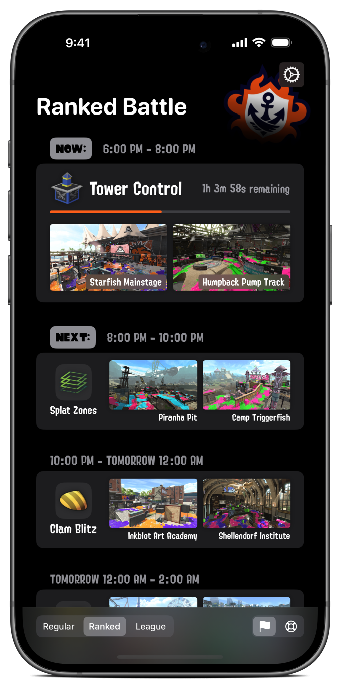
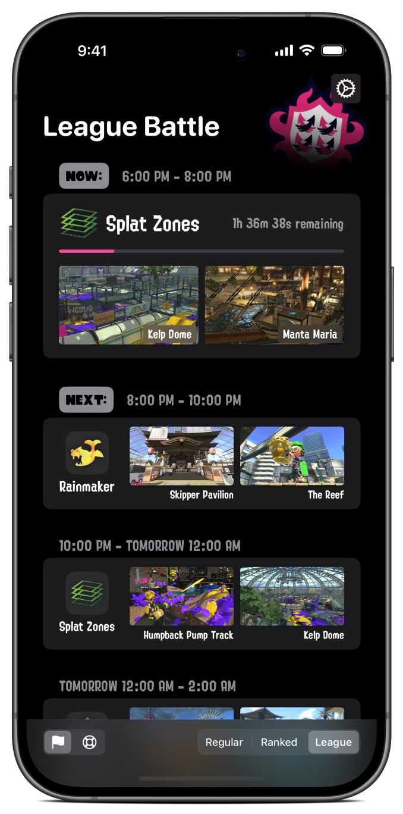
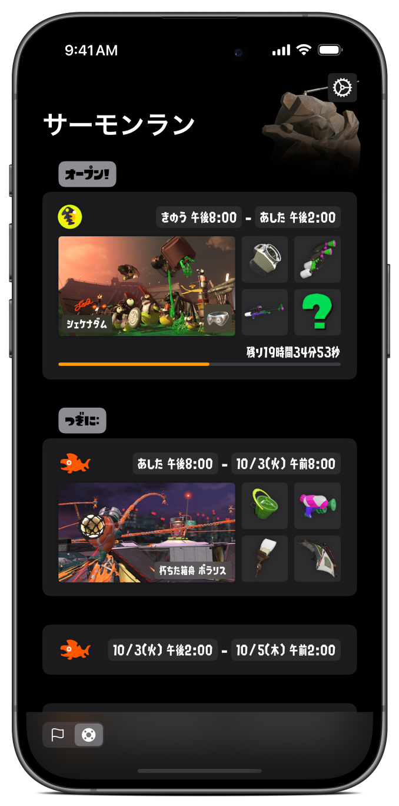
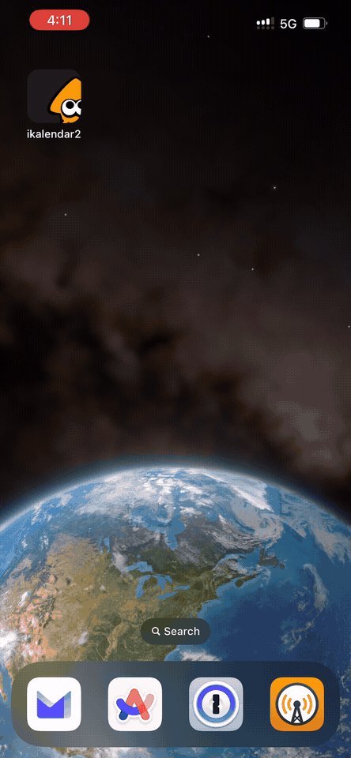
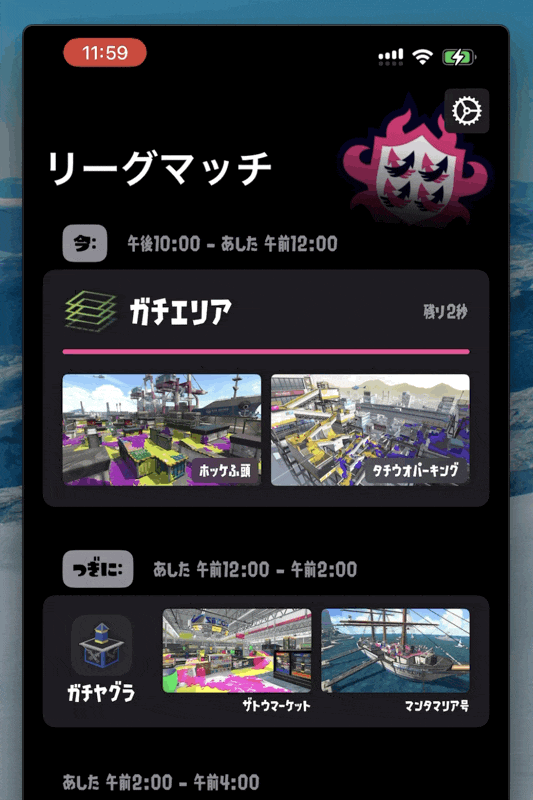

<!-- markdownlint-disable MD033 MD041 -->

  

<h1 align="center"/>ikalendar2</h1>

Track Splatoon 2 rotation schedules with style and ease.

# Features

- View the current and upcoming rotation info for all modes in Splatoon 2.
- Robust **Auto-Refresh** system that always fetches the latest rotations for you so you don't have to.
- Meticulously crafted **UI design** with seamless **animations**, optimized for both iOS and iPadOS.
- A variety of **customization options** & App Icons to choose from, suited for different styles and needs.
- Native localization support for both **English** and **Japanese**.

# Download

ikalendar2 is available on the App Store for free.

# Compatibilities & Environments

- iOS / iPadOS `17.0` or later is required for the latest version of ikalendar2.

- Compatibility with macOS running on Apple Silicon is not targeted, but beta tests on MacBook Air M1 with macOS `14.5` show no breaking issues.

- visionOS compatibility is not tested for.

- watchOS, tvOS, and macOS running on Intel-based Macs are not yet supported.

- Development environment includes Xcode `15.4` and Swift `5.10`.

# Demo

<!-- Have to set both `align="center"` and `style="text-align: center;"`
since some markdown parsers don't support one or the other.  -->
<table align="center" width="100%" style="text-align: center;">
  <thead>
    <tr>
      <th align="center" width="33%" style="text-align: center;">Ranked Battle (English)</th>
      <th align="center" width="33%" style="text-align: center;">League Battle (English)</th>
      <th align="center" width="33%" style="text-align: center;">Salmon Run (Japanese)</th>
    </tr>
  </thead>
  <tbody>
    <tr>
      <td align="center" width="33%" style="text-align: center;">No Customization</td>
      <td align="center" width="33%" style="text-align: center;">Custom Stage Image & Bottom Toolbar</td>
      <td align="center" width="33%" style="text-align: center;">Custom Stage Image & Bottom Toolbar</td>
    </tr>
    <tr>
      <td align="center" width="33%"></td>
      <td align="center" width="33%"></td>
      <td align="center" width="33%"></td>
    </tr>
  </tbody>
</table>

<table align="center" width="100%" style="text-align: center;">
  <thead>
    <tr>
      <th align="center" width="33%" style="text-align: center;">Welcome Screen</th>
      <th align="center" width="33%" style="text-align: center;">Transition between Rotations</th>
      <th align="center" width="33%" style="text-align: center;">Auto Refresh for Newly Available Rotations</th>
    </tr>
  </thead>
  <tbody>
    <tr>
      <td align="center" width="33%" style="text-align: center;"></td>
      <td align="center" width="33%" style="text-align: center;"></td>
      <td align="center" width="33%" style="text-align: center;"></td>
    </tr>
  </tbody>
</table>

# Acknowledgements

ikalendar2 is made possible thanks to the following projects:

<!-- markdownlint-disable-next-line MD001 -->
### Data Sources

- [Splatoon2.ink](https://github.com/misenhower/splatoon2.ink/wiki/Data-access-policy#data-urls)
- [JelonzoBot](https://splatoon.oatmealdome.me/about)

### Dependencies

- [SwiftyJSON](https://github.com/SwiftyJSON/SwiftyJSON)
- [SimpleHaptics](https://github.com/notbd/SimpleHaptics)
- [AlertKit](https://github.com/sparrowcode/AlertKit)

# Website

[ikalendar.app](https://ikalendar.app) is the official website for ikalendar2. The site is built with VitePress and deployed on Vercel.

Source code of the website is located [here](https://github.com/notbd/Ikalendar2/tree/main/docs) within the `/docs` directory under the current repo.

# Archives

Early versions of ikalendar2 was archived in a [separate repository](https://github.com/notbd/ikalendar-2-archived). The reason for a new repo at the time was due to the need for a major refactoring, as well as implementing more robust coding practices and standards.

# Privacy

ikalendar2 does not collect any data about the user or upload any information. Here's the link to the [Privacy Policy](https://ikalendar.app/privacy-policy).

# License

ikalendar2 is licensed under the [GPL-3.0 License](./LICENSE).

# Disclaimer

ikalendar2 is a third-party companion app for Splatoon™ 2 and is not affiliated with Nintendo. All associated item names, logos, and trademarks are the property of their respective owners.
