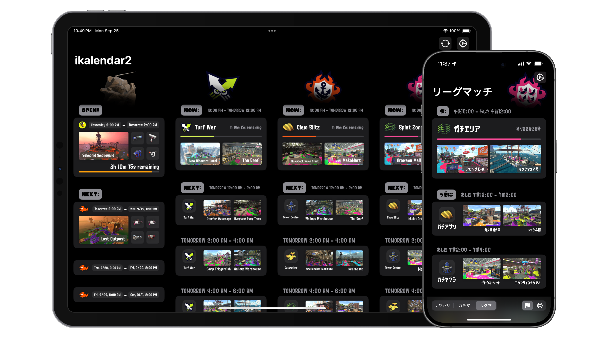

<!-- markdownlint-disable MD033 MD041 -->

  

<h1 align="center"/>ikalendar2</h1>

Track Splatoon 2 rotation schedules with style and ease.

# Features

- View the current and upcoming rotation info for all modes including Salmon Run.
- Meticulously crafted **UI design** with seamless **animations**, optimized for both iOS and iPadOS.
- Native support for both **English** and **Japanese**.
- A variety of **customization** options & App Icons to choose from, suited for different styles and needs.
- Smart and reliable **Auto-Refresh** system that always keeps the schedule up-to-date.

# Installation

ikalendar2 is available on the App Store for free.

# Compatibilities & Environments

iOS / iPadOS `17.0` or later is required for the latest version of ikalendar2.

Compatibility with macOS running on Apple Silicon is not targeted, but beta tests on MacBook Air M1 with macOS `14.5` show no breaking issues.

visionOS compatibility is not tested for.

watchOS, tvOS and macOS running on Intel-based Macs are not yet supported.

Development environment includes Xcode `15.4` and Swift `5.10`.

# GIF Demos

Transition animations | Auto refresh for newly available rotations
:-------------------------:|:-------------------------:
 | 

# Acknowledgements

ikalendar2 is made possible thanks to the following projects:

<!-- markdownlint-disable-next-line MD001 -->
### Data Sources

- [Splatoon2.ink](https://github.com/misenhower/splatoon2.ink)
- [JelonzoBot](https://splatoon.oatmealdome.me/about)

### Dependencies

- [SwiftyJSON](https://github.com/SwiftyJSON/SwiftyJSON)
- [SimpleHaptics](https://github.com/notbd/SimpleHaptics)
- [AlertKit](https://github.com/sparrowcode/AlertKit)

# License

ikalendar2 is licensed under the [GPL-3.0 License](./LICENSE).

# Privacy

ikalendar2 does not collect any personal information or upload any data about the user. The privacy policy can be found [here](https://github.com/notbd/Ikalendar2/wiki/Privacy-Policy).

# Disclaimer

ikalendar2 is a third-party companion app for Splatoon™ 2 and is not affiliated with Nintendo. All associated item names, logos, and trademarks are the property of their respective owners.
