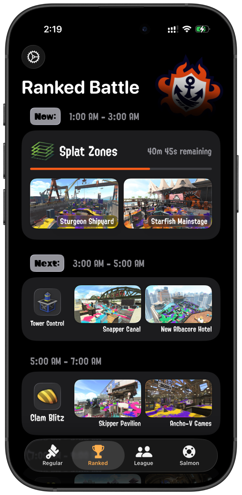
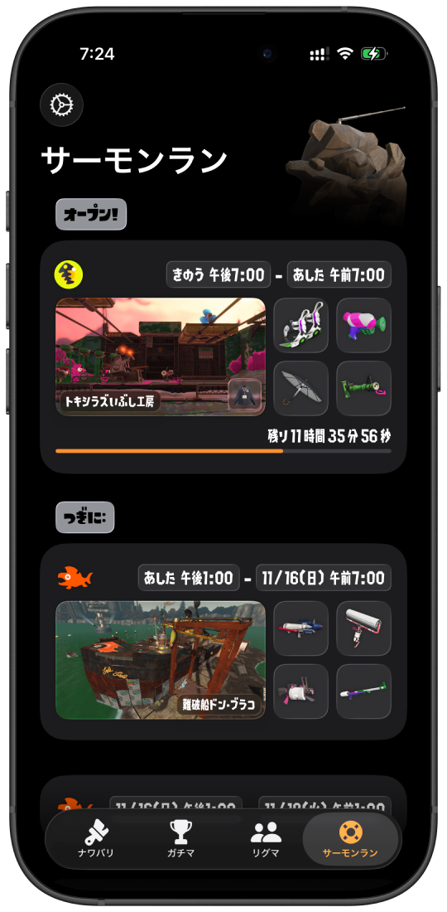
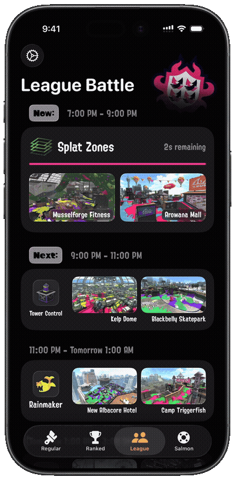

<!-- markdownlint-disable MD033 MD041 -->

  

<h1 align="center"/>ikalendar2</h1>

Track Splatoon 2 rotation schedules with style and ease.

  

  <picture>
    <source
      srcset="./Resources/MetaAssets/README/Demos/demo-universal.webp"
      type="image/webp">
    
  </picture>

# Overview

ikalendar2 is an iOS app for tracking Splatoon 2 rotation schedules. It's an alternative to Nintendo's official companion app that cuts straight to the point and provides quick access to current rotation info in the form of a modern, clutter-free interface.

# Features

- ***NEW***: fully updated to adopt the latest **Liquid Glass** visual style and UI elements
- **Instant access** to rotation schedules with a clean interface
- Seamless **auto-refresh** to keep rotation data always up-to-date
- **Smooth animations** and game-inspired visual details
- **Customization options** to suit your needs and playstyle
- **Localization support** for English and Japanese
- UI Layout optimized for both **iPhone** and **iPad**

# Installation

ikalendar2 is available for download on the App Store for free.

# Compatibilities

- Latest version of ikalendar2 requires iOS / iPadOS `26.0` or later.

- Previous versions compatible with OSes from iOS / iPadOS `13` to `18` are still available on the App Store for users with older devices.

- Compatibility with macOS on Apple Silicon is provided through Mac Catalyst.

# Previews

<!-- Have to set both `align="center"` and `style="text-align: center;"`
since some markdown parsers don't support one or the other.  -->
<table align="center" width="100%" style="text-align: center;">
  <thead>
    <tr>
      <th align="center" width="33%" style="text-align: center;">Ranked Battle</th>
      <th align="center" width="33%" style="text-align: center;">League Battle (Customizations)</th>
      <th align="center" width="33%" style="text-align: center;">Salmon Run (Japanese)</th>
    </tr>
  </thead>
  <tbody>
    <tr>
      <td align="center" width="33%">
        
      </td>
      <td align="center" width="33%">
        
      </td>
      <td align="center" width="33%">
        
      </td>
    </tr>
  </tbody>
</table>

<table align="center" width="100%" style="text-align: center;">
  <thead>
    <tr>
      <th align="center" width="33%" style="text-align: center;">Welcome Screen (icon is clickable!)</th>
      <th align="center" width="33%" style="text-align: center;">Transition between rotations</th>
      <th align="center" width="33%" style="text-align: center;">Auto-Refresh for newly available rotations</th>
    </tr>
  </thead>
  <tbody>
    <tr>
      <td align="center" width="33%" style="text-align: center;">
        
      </td>
      <td align="center" width="33%" style="text-align: center;">
        
      </td>
      <td align="center" width="33%" style="text-align: center;">
        
      </td>
    </tr>
  </tbody>
</table>

# Background

Nintendo's official companion app for Splatoon 2 makes checking rotations unnecessarily tedious. A typical workflow requires navigating through multiple screens, each with slow loading times and a cluttered, misclick-prone interface. It usually takes 15-25 seconds for such a trivial task to be done.

I built ikalendar2 to solve this specific problem. It fetches **only the necessary data** from sources and presents the info **immediately** when you open it. No extra steps or waiting around.

ikalendar2 is written in SwiftUI using modern iOS features and APIs. I tried to capture some of Splatoon's visual style while keeping the interface clean and functional. The goal is to make it the perfect tool not just for myself but also for all other players who need a better way to keep up with the game.

# Website

ikalendar2 has a landing page hosted at [`ikalendar.app`](https://ikalendar.app).

[Source code of the site](https://github.com/notbd/Ikalendar2/tree/main/docs) is located within the `/docs` directory under current repo.

# Archive

The source code for early versions of ikalendar2 was archived at a [separate repo](https://github.com/notbd/ikalendar-2-archived).

The UI and structure of the app has changed so much that at one point I figured it deserved a rewrite from the ground up. Around that time I also started to enforce SwiftLint and SwiftFormat to help streamline coding style and practices so starting fresh with a new repository made a lot of sense to me.

# Privacy

ikalendar2 does not collect any data about users or upload any information. If you are a fan of fine prints I got some for you in the [Privacy Policy](https://ikalendar.app/privacy-policy).

# Acknowledgements

ikalendar2 is made possible thanks to the following projects:

<!-- markdownlint-disable-next-line MD001 -->
### Data Sources

- [Splatoon2.ink](https://github.com/misenhower/splatoon2.ink/wiki/Data-access-policy#data-urls)
- [JelonzoBot](https://splatoon.oatmealdome.me/about)

### Dependencies

- [SwiftyJSON](https://github.com/SwiftyJSON/SwiftyJSON)
- [SimpleHaptics](https://github.com/notbd/SimpleHaptics)
- [AlertKit](https://github.com/sparrowcode/AlertKit)

# License

[GPL-3.0 License](./LICENSE)

# Disclaimer

ikalendar2 is a third-party companion app for Splatoon 2 and is not affiliated with Nintendo. All associated item names, logos, and trademarks are the property of their respective owners.
