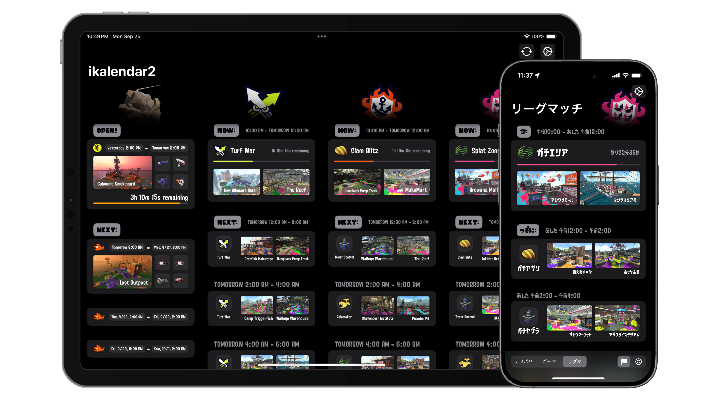
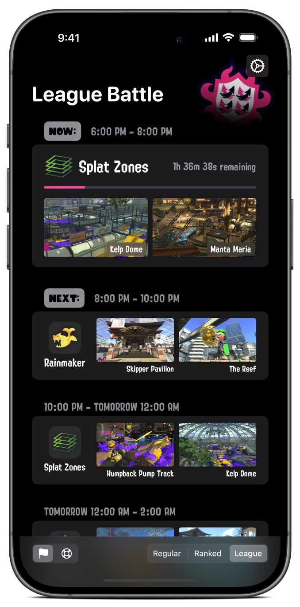
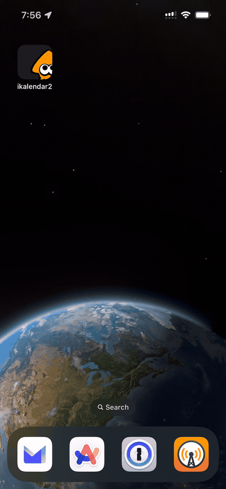
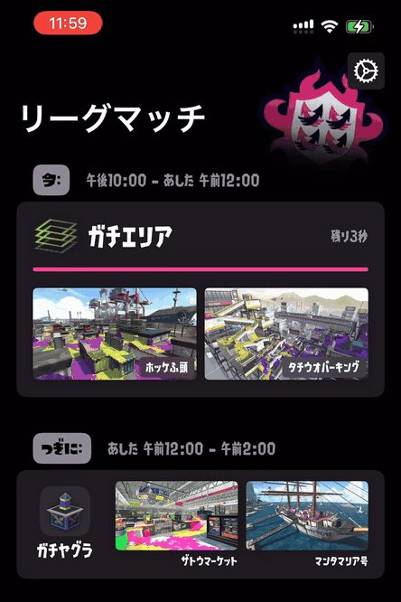

<!-- markdownlint-disable MD033 MD041 -->

  

<h1 align="center"/>ikalendar2</h1>

Track Splatoon 2 rotation schedules with style and ease.

  

# Overview

ikalendar2 is an iOS app for tracking Splatoon 2 rotation schedules. It's an alternative to Nintendo's official companion app that cuts straight to the point and provides quick access to current rotation information.

# Features

- **Instant access** to rotation schedules with a clean interface
- Seamless **auto-refresh** to keep rotation data always current
- **Smooth animations** and game-inspired visual details
- **Customization options** to suit your needs and playstyle
- Support for **English** and **Japanese**
- Layout optimized for both **iPhone** and **iPad**

# Background

Nintendo's official companion app makes checking rotations unnecessarily tedious. A typical workflow requires navigating through multiple screens, each with slow loading times and a cluttered interface that's prone to misclicks. Such a seemingly trivial task takes as long as **15-25 seconds** on average.

I built ikalendar2 to solve this specific problem. It fetches **only the necessary data** from sources and presents the info **immediately** when you open it - no extra steps or waiting around.

ikalendar2 is written in SwiftUI using modern iOS features and APIs. I tried to capture some of Splatoon's visual style while keeping the interface clean and functional. I polished ikalendar2 into the perfect tool for me as a Splatoon player myself, and I believe it translates well to other players in the same shoes.

# Installation

ikalendar2 is available for download on the App Store for free.

# Compatibilities

- iOS / iPadOS `17.0` or later.

- macOS compatibility is not targeted, however beta test on MacBook Air M1 with macOS `15.5` shows no breaking issues.

# Previews

<!-- Have to set both `align="center"` and `style="text-align: center;"`
since some markdown parsers don't support one or the other.  -->
<table align="center" width="100%" style="text-align: center;">
  <thead>
    <tr>
      <th align="center" width="33%" style="text-align: center;">Ranked Battle (English)</th>
      <th align="center" width="33%" style="text-align: center;">League Battle (English)</th>
      <th align="center" width="33%" style="text-align: center;">Salmon Run (Japanese)</th>
    </tr>
  </thead>
  <tbody>
    <tr>
      <td align="center" width="33%" style="text-align: center;">No Customization</td>
      <td align="center" width="33%" style="text-align: center;">Custom Stage Image & Bottom Toolbar</td>
      <td align="center" width="33%" style="text-align: center;">Custom Stage Image & Bottom Toolbar</td>
    </tr>
    <tr>
      <td align="center" width="33%"></td>
      <td align="center" width="33%"></td>
      <td align="center" width="33%"></td>
    </tr>
  </tbody>
</table>

<table align="center" width="100%" style="text-align: center;">
  <thead>
    <tr>
      <th align="center" width="33%" style="text-align: center;">Welcome Screen (icon is clickable!)</th>
      <th align="center" width="33%" style="text-align: center;">Transition between Rotations</th>
      <th align="center" width="33%" style="text-align: center;">Auto Refresh for Newly Available Rotations</th>
    </tr>
  </thead>
  <tbody>
    <tr>
      <td align="center" width="33%" style="text-align: center;"></td>
      <td align="center" width="33%" style="text-align: center;"></td>
      <td align="center" width="33%" style="text-align: center;"></td>
    </tr>
  </tbody>
</table>

# Acknowledgements

ikalendar2 is made possible thanks to the following projects:

<!-- markdownlint-disable-next-line MD001 -->
### Data Sources

- [Splatoon2.ink](https://github.com/misenhower/splatoon2.ink/wiki/Data-access-policy#data-urls)
- [JelonzoBot](https://splatoon.oatmealdome.me/about)

### Dependencies

- [SwiftyJSON](https://github.com/SwiftyJSON/SwiftyJSON)
- [SimpleHaptics](https://github.com/notbd/SimpleHaptics)
- [AlertKit](https://github.com/sparrowcode/AlertKit)

# Website

ikalendar2 has a landing page hosted at [`ikalendar.app`](https://ikalendar.app).

Source code of the site is located [here](https://github.com/notbd/Ikalendar2/tree/main/docs) within the `/docs` directory under current repo.

# Archive

The source code for early versions of ikalendar2 was archived at a [separate repo](https://github.com/notbd/ikalendar-2-archived).

The UI and structure of the app has changed so much that at one point I figured it deserved a rewrite. Around that time I also started to enforce SwiftLint and SwiftFormat to help streamline coding style and practices, so starting fresh with a new repository made a lot of sense to me.

# Privacy

ikalendar2 does not collect any data about users or upload any information. If you are a fan of fine prints I got some for you in the [Privacy Policy](https://ikalendar.app/privacy-policy).

# License

[GPL-3.0 License](./LICENSE)

# Disclaimer

ikalendar2 is a third-party companion app for Splatoon™ 2 and is not affiliated with Nintendo. All associated item names, logos, and trademarks are the property of their respective owners.
